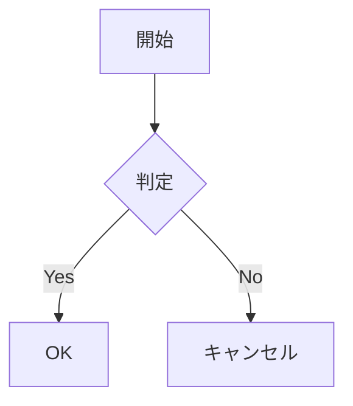

# mdvim

Vimキーバインドを搭載したMarkdownエディタ。Monaco Editorベース。

## 機能

### エディタ
- 完全なVimキーバインド（monaco-vim）
- ライブプレビュー（同期スクロール）
- 9種類のカラーテーマ（Dark, Light, Monokai, Solarized, Nord, Dracula, GitHub）
- 自動保存機能
- 目次パネル（H1-H3）
- 折りたたみセクション（H1-H3）

### Markdown対応
- GitHub Flavored Markdown (GFM)
- テーブル（配置指定対応）
- タスクリスト（`- [ ]` / `- [x]`）
- コードブロック（シンタックスハイライト）
- 数式（KaTeX） - インライン `$...$` / ブロック `$$...$$`
- Mermaidダイアグラム
- 脚注
- ルビ（振り仮名） - 青空文庫記法 `｜漢字《かんじ》`
- アラートブロック（Qiita/GitHub風）

### ファイル操作
- ファイルの開く/保存（`.md`, `.mdvim`）
- `.mdvim`形式：画像を埋め込んだZIPアーカイブ
- ドラッグ＆ドロップ（ファイル、画像）
- クリップボードから画像貼り付け（Ctrl+V）
- URLからMarkdown取得（Qiita, GitHub, Gist）
- カレントディレクトリ対応（`:pwd`, `:cd`）

### 出力
- HTML出力（`:export`）
- PDF出力（`:pdf`）

## インストール

### ビルド済みバイナリ

[Releases](https://github.com/user/mdvim-monaco/releases)からダウンロード。

### ソースからビルド

```bash
# リポジトリをクローン
git clone https://github.com/user/mdvim-monaco.git
cd mdvim-monaco

# 依存関係をインストール
npm install

# 開発モード
npm run dev

# Webバージョンをビルド
npm run build

# デスクトップアプリをビルド（Rust必要）
npm run tauri build
```

## 使い方

### コマンドライン

```bash
mdvim                    # エディタを開く
mdvim document.md        # ファイルを開く
mdvim https://...        # URLから取得
```

### Vimコマンド

| コマンド | 説明 |
|----------|------|
| `:w` | 保存 |
| `:w filename` | 名前を付けて保存 |
| `:e filename` | ファイルを開く |
| `:e URL` | URLからMarkdown取得 |
| `:fetch` / `:url` | URLからMarkdown取得（プロンプト） |
| `:new` | 新規ファイル |
| `:q` | 終了 |
| `:q!` | 保存せずに終了 |
| `:wq` | 保存して終了 |
| `:pwd` | カレントディレクトリ表示 |
| `:cd path` | ディレクトリ変更 |
| `:toc` | 目次の表示/非表示 |
| `:export` | HTML出力 |
| `:pdf` | PDF出力 |
| `:image` | 画像挿入 |
| `:help` | ヘルプ表示 |

### 設定コマンド

| コマンド | 説明 |
|----------|------|
| `:set wrap` / `:set nowrap` | 折り返しの切り替え |
| `:set number` / `:set nonumber` | 行番号の切り替え |
| `:set tabsize=N` | タブサイズ設定（1-8） |
| `:set autosave` / `:set noautosave` | 自動保存の切り替え |
| `:set autosaveinterval=N` | 自動保存間隔（5-300秒） |

### キーボードショートカット

| キー | 説明 |
|------|------|
| `Ctrl+S` | 保存 |
| `Ctrl+Shift+S` | 名前を付けて保存 |
| `Ctrl+O` | ファイルを開く |
| `Ctrl+N` | 新規ファイル |
| `Ctrl+`` ` | Vimモード切り替え |
| `F1` | ヘルプ表示 |

## Markdown拡張記法

### ルビ（振り仮名）

```markdown
｜漢字《かんじ》
```

表示: <ruby>漢字<rt>かんじ</rt></ruby>

### アラートブロック

```markdown
:::note
これはノートです
:::

:::warning
これは警告です
:::
```

### 数式（KaTeX）

```markdown
インライン: $E = mc^2$

ブロック:
$$
\sum_{i=1}^{n} x_i = x_1 + x_2 + \cdots + x_n
$$
```

### Mermaidダイアグラム

````markdown

````

## 設定ファイル

設定は以下に保存されます：
- Windows: `%USERPROFILE%\.config\mdvim\config.json`
- macOS/Linux: `~/.config/mdvim/config.json`

## ライセンス

MIT License

## クレジット

- [Monaco Editor](https://microsoft.github.io/monaco-editor/)
- [monaco-vim](https://github.com/brijeshb42/monaco-vim)
- [marked](https://marked.js.org/)
- [KaTeX](https://katex.org/)
- [Mermaid](https://mermaid.js.org/)
- [Tauri](https://tauri.app/)
