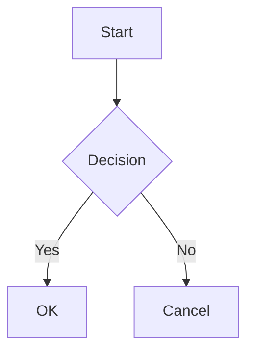

# mdvim

A Markdown editor with Vim keybindings, powered by Monaco Editor.

## Features

### Editor
- Full Vim keybindings (via monaco-vim)
- Live preview with synchronized scrolling
- 9 color themes (Dark, Light, Monokai, Solarized, Nord, Dracula, GitHub)
- Auto-save functionality
- Table of Contents panel (H1-H3)
- Collapsible sections (H1-H3)

### Markdown Support
- GitHub Flavored Markdown (GFM)
- Tables with alignment
- Task lists (`- [ ]` / `- [x]`)
- Fenced code blocks with syntax highlighting
- Math equations (KaTeX) - inline `$...$` and block `$$...$$`
- Mermaid diagrams
- Footnotes
- Ruby (furigana) notation - Aozora Bunko style `｜漢字《かんじ》`
- Alert blocks (Qiita/GitHub style)

### File Operations
- Open/Save files (`.md`, `.mdvim`)
- `.mdvim` format: ZIP archive with embedded images
- Drag & drop files and images
- Paste images from clipboard (Ctrl+V)
- Fetch markdown from URLs (Qiita, GitHub, Gist)
- Current directory support (`:pwd`, `:cd`)

### Export
- HTML export (`:export`)
- PDF export (`:pdf`)

## Installation

### Pre-built Binaries

Download from [Releases](https://github.com/user/mdvim-monaco/releases).

### Build from Source

#### Using Build Scripts (Recommended)

```bash
# Linux (Ubuntu 24.04+)
./scripts/build-linux.sh

# macOS
./scripts/build-macos.sh

# Windows (run in Command Prompt)
scripts\build-windows.bat
```

#### Manual Build

```bash
# Clone repository
git clone https://github.com/user/mdvim-monaco.git
cd mdvim-monaco

# Install dependencies
npm install

# Development
npm run dev

# Build web version
npm run build

# Build desktop app (requires Rust)
npm run tauri build
```

## Usage

### Command Line

```bash
mdvim                    # Open editor
mdvim document.md        # Open file
mdvim https://...        # Fetch from URL
```

### Vim Commands

| Command | Description |
|---------|-------------|
| `:w` | Save file |
| `:w filename` | Save as |
| `:e filename` | Open file |
| `:e URL` | Fetch markdown from URL |
| `:fetch` / `:url` | Fetch markdown (prompt) |
| `:new` | New file |
| `:q` | Quit |
| `:q!` | Quit without saving |
| `:wq` | Save and quit |
| `:pwd` | Show current directory |
| `:cd path` | Change directory |
| `:toc` | Toggle Table of Contents |
| `:export` | Export to HTML |
| `:pdf` | Export to PDF |
| `:image` | Insert image |
| `:help` | Show help |

### Settings Commands

| Command | Description |
|---------|-------------|
| `:set wrap` / `:set nowrap` | Toggle word wrap |
| `:set number` / `:set nonumber` | Toggle line numbers |
| `:set tabsize=N` | Set tab size (1-8) |
| `:set autosave` / `:set noautosave` | Toggle auto-save |
| `:set autosaveinterval=N` | Set auto-save interval (5-300 seconds) |

### Keyboard Shortcuts

| Key | Description |
|-----|-------------|
| `Ctrl+S` | Save |
| `Ctrl+Shift+S` | Save as |
| `Ctrl+O` | Open file |
| `Ctrl+N` | New file |
| `Ctrl+`` ` | Toggle Vim mode |
| `F1` | Toggle help |

## Markdown Extensions

### Ruby (Furigana)

```markdown
｜漢字《かんじ》
```

Renders as: <ruby>漢字<rt>かんじ</rt></ruby>

### Alert Blocks

```markdown
:::note
This is a note
:::

:::warning
This is a warning
:::
```

### Math (KaTeX)

```markdown
Inline: $E = mc^2$

Block:
$$
\sum_{i=1}^{n} x_i = x_1 + x_2 + \cdots + x_n
$$
```

### Mermaid Diagrams

````markdown

````

## Configuration

Settings are stored in:
- Windows: `%USERPROFILE%\.config\mdvim\config.json`
- macOS/Linux: `~/.config/mdvim/config.json`

## License

MIT License

## Credits

- [Monaco Editor](https://microsoft.github.io/monaco-editor/)
- [monaco-vim](https://github.com/brijeshb42/monaco-vim)
- [marked](https://marked.js.org/)
- [KaTeX](https://katex.org/)
- [Mermaid](https://mermaid.js.org/)
- [Tauri](https://tauri.app/)
