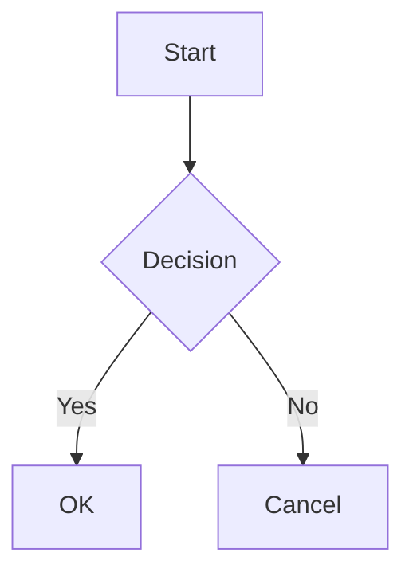

# mdvim Tutorial

A Markdown editor with Vim keybindings, built on Monaco Editor.

---

## Getting Started

### Interface Overview

```
┌─────────────────────────────────────────────────────────┐
│ Toolbar: [filename] [Editor|Split|Preview] [VIM] [Theme]│
├────────┬────────────────────────┬───────────────────────┤
│        │                        │                       │
│  TOC   │       Editor           │      Preview          │
│        │                        │                       │
│        │                        │                       │
├────────┴────────────────────────┴───────────────────────┤
│ Statusbar: [cursor position] [vim mode] [stats]         │
└─────────────────────────────────────────────────────────┘
```

### Vim Modes

| Mode | Enter | Description |
|------|-------|-------------|
| **Normal** | `Esc` | Navigation and commands |
| **Insert** | `i`, `a`, `o` | Text input |
| **Visual** | `v` | Character selection |
| **Visual Line** | `V` | Line selection |
| **Command** | `:` | Execute Ex commands |

---

## Keyboard Shortcuts

### Global Shortcuts

| Key | Action |
|-----|--------|
| `Ctrl+O` | Open file |
| `Ctrl+S` | Save file |
| `Ctrl+Shift+S` | Save as |
| `Ctrl+N` | New file |
| `Ctrl+`` ` | Toggle Vim mode |
| `F1` | Show help |
| `Escape` | Close modal / Return to normal mode |

### Project Mode Shortcuts

| Key | Action |
|-----|--------|
| `Ctrl+E` | Toggle Explorer panel |
| `Ctrl+Shift+F` | Search in project |
| `Ctrl+Tab` | Next buffer |
| `Ctrl+Shift+Tab` | Previous buffer |
| `Alt+←` | Navigate back in history |
| `Alt+→` | Navigate forward in history |

### Clipboard Operations (Vim Style)

| Key | Action |
|-----|--------|
| `"*y` | Copy selection to system clipboard |
| `"*yy` | Copy current line to system clipboard |
| `"*p` | Paste from system clipboard (after cursor) |
| `"*P` | Paste from system clipboard (before cursor) |
| `"+y` / `"+p` | Same as above (alternative register) |

---

## Vim Commands (Ex Commands)

### File Operations

| Command | Shorthand | Description |
|---------|-----------|-------------|
| `:write [filename]` | `:w` | Save file (optionally with new name) |
| `:edit [path/URL]` | `:e` | Open file or URL |
| `:new [filename]` | `:new` | Create new file |
| `:quit` | `:q` | Quit (close project or exit) |
| `:quit!` | `:q!` | Quit without saving |
| `:wq` | `:wq` | Save and quit |
| `:xit` | `:x` | Save (if modified) and quit |
| `:exit` | `:exi` | Force exit application |
| `:qall` | `:qa` | Quit all (`:qa!` to force) |

### Directory Operations

| Command | Shorthand | Description |
|---------|-----------|-------------|
| `:pwd` | `:pwd` | Show current directory |
| `:cd <path>` | `:cd` | Change current directory |

### Project Commands

| Command | Shorthand | Description |
|---------|-----------|-------------|
| `:project new [name]` | `:proj new` | Create new project |
| `:project open` | `:proj open` | Open project file (.mdvim) |
| `:project save` | `:proj save` | Save project |
| `:project close` | `:proj close` | Close project |
| `:project status` | `:proj status` | Show project status |

### Buffer Commands (Project Mode)

| Command | Shorthand | Description |
|---------|-----------|-------------|
| `:vnew [name]` | `:vnew` | Create new file in project |
| `:vpaste [name]` | `:vp` | Create new file from clipboard |
| `:bnext` | `:bn` | Go to next buffer |
| `:bprev` | `:bp` | Go to previous buffer |
| `:buffer <name>` | `:b` | Switch to buffer by name |
| `:ls` | `:ls` | List all buffers |
| `:buffers` | `:buffers` | List all buffers |
| `:bdelete [name]` | `:bd` | Delete buffer (close file) |
| `:rename <name>` | `:ren` | Rename current file |

### View Commands

| Command | Shorthand | Description |
|---------|-----------|-------------|
| `:toc` | `:toc` | Toggle Table of Contents |
| `:explorer` | `:ex` | Toggle Explorer panel |
| `:Ex` | `:Ex` | Toggle Explorer panel |
| `:help` | `:h` | Show help modal |

### Layout Presets

| Command | Description |
|---------|-------------|
| `:layout default` | Default layout (TOC + Preview) |
| `:layout obsidian` | Obsidian-style (Explorer + TOC + Preview) |
| `:layout minimal` | Minimal (Preview only) |
| `:layout writer` | Writer mode (TOC on left, no preview) |
| `:layout code` | Code mode (Explorer + Tabs, no preview) |

### Search Commands (Project Mode)

| Command | Shorthand | Description |
|---------|-----------|-------------|
| `:grep <pattern>` | `:gr` | Search in all files |
| `:search <pattern>` | `:sea` | Search in all files |

### Import / Export Commands

| Command | Shorthand | Description |
|---------|-----------|-------------|
| `:import [path/URL]` | `:imp` | Import file or URL |
| `:export` | `:exp` | Open export dialog |
| `:exp md` | | Export current page as Markdown |
| `:exp md-inline` | | Export with inline images |
| `:exp html` | | Export as HTML |
| `:exp pdf` | | Export as PDF |
| `:exp all md` | | Export all pages to folder |
| `:exp all merge` | | Export all pages merged |
| `:exp all html` | | Export all as single HTML |
| `:exp all pdf` | | Export all as PDF |
| `:exp mdbook` | | Export as mdbook format |

### Image Commands

| Command | Shorthand | Description |
|---------|-----------|-------------|
| `:image` | `:ima` | Insert image from file |

---

## Settings Commands

### `:set` Options

| Command | Description |
|---------|-------------|
| `:set wrap` | Enable word wrap |
| `:set nowrap` | Disable word wrap |
| `:set number` / `:set nu` | Show line numbers |
| `:set nonumber` / `:set nonu` | Hide line numbers |
| `:set minimap` | Show minimap |
| `:set nominimap` | Hide minimap |
| `:set vim` | Enable Vim mode |
| `:set novim` | Disable Vim mode |
| `:set autosave` | Enable auto-save |
| `:set noautosave` | Disable auto-save |
| `:set tabsize=N` / `:set ts=N` | Set tab size (1-8) |
| `:set fontsize=N` / `:set fs=N` | Set font size (%) |
| `:set autosaveinterval=N` | Set auto-save interval (5-300 seconds) |
| `:set theme=<name>` | Set theme |

### `:theme` Command

| Command | Description |
|---------|-------------|
| `:theme dark` | Dark theme |
| `:theme light` | Light theme |
| `:theme monokai` | Monokai theme |
| `:theme solarized-dark` | Solarized Dark |
| `:theme solarized-light` | Solarized Light |
| `:theme nord` | Nord theme |
| `:theme dracula` | Dracula theme |
| `:theme github-dark` | GitHub Dark |
| `:theme github-light` | GitHub Light |

---

## Markdown Extensions

### Task Lists

```markdown
- [ ] Unchecked task
- [x] Checked task
```

### Footnotes

```markdown
Here is a footnote reference[^1].

[^1]: This is the footnote content.
```

### Ruby (Furigana)

Aozora Bunko style:
```markdown
｜漢字《かんじ》
```

Renders as: <ruby>漢字<rt>かんじ</rt></ruby>

### Alert Blocks

**Qiita style:**
```markdown
:::note info
This is an info note.
:::

:::note warn
This is a warning.
:::

:::note alert
This is an alert.
:::
```

**GitHub style:**
```markdown
> [!NOTE]
> This is a note.

> [!WARNING]
> This is a warning.

> [!TIP]
> This is a tip.
```

### Math (KaTeX)

**Inline math:**
```markdown
The equation $E = mc^2$ is famous.
```

**Block math:**
```markdown
$$
\sum_{i=1}^{n} x_i = x_1 + x_2 + \cdots + x_n
$$
```

### Mermaid Diagrams

````markdown

````

### Image Size

```markdown
{width=300}
{width=50%}
```

---

## File Formats

### Single File

- `.md` - Standard Markdown file

### Project File

- `.mdvim` - ZIP archive containing:
  - `manifest.json` - Project metadata and file list
  - `chapters/` - Markdown files
  - `images/` - Embedded images

---

## Drag & Drop

| File Type | Action |
|-----------|--------|
| `.md`, `.txt` | Add to project (or convert to project) |
| `.mdvim` | Open project |
| Image files | Insert as embedded image |

---

## Tips

1. **Quick file switch**: Use `:b <partial-name>` to switch buffers
2. **Search and replace**: Use Vim's `:%s/old/new/g` command
3. **Fold sections**: Click on heading fold icons in preview
4. **Auto-save**: Enable with `:set autosave` for automatic backups
5. **Clipboard**: Use `"*y` and `"*p` to interact with system clipboard
