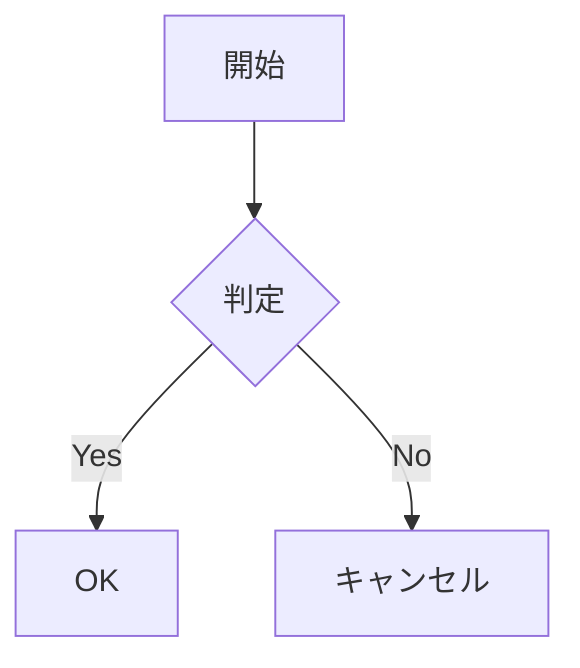

# mdvim チュートリアル

Monaco Editorベースの、Vimキーバインドを搭載したMarkdownエディタです。

---

## はじめに

### インターフェース概要

```
┌─────────────────────────────────────────────────────────┐
│ ツールバー: [ファイル名] [Editor|Split|Preview] [VIM] [テーマ]│
├────────┬────────────────────────┬───────────────────────┤
│        │                        │                       │
│  目次  │       エディタ          │      プレビュー        │
│        │                        │                       │
│        │                        │                       │
├────────┴────────────────────────┴───────────────────────┤
│ ステータスバー: [カーソル位置] [Vimモード] [統計情報]      │
└─────────────────────────────────────────────────────────┘
```

### Vimモード

| モード | 入り方 | 説明 |
|--------|--------|------|
| **ノーマル** | `Esc` | ナビゲーションとコマンド |
| **インサート** | `i`, `a`, `o` | テキスト入力 |
| **ビジュアル** | `v` | 文字単位の選択 |
| **ビジュアル行** | `V` | 行単位の選択 |
| **コマンド** | `:` | Exコマンドの実行 |

---

## キーボードショートカット

### グローバルショートカット

| キー | 動作 |
|------|------|
| `Ctrl+O` | ファイルを開く |
| `Ctrl+S` | 保存 |
| `Ctrl+Shift+S` | 名前を付けて保存 |
| `Ctrl+N` | 新規ファイル |
| `Ctrl+`` ` | Vimモード切り替え |
| `F1` | ヘルプ表示 |
| `Escape` | モーダルを閉じる / ノーマルモードに戻る |

### プロジェクトモード用ショートカット

| キー | 動作 |
|------|------|
| `Ctrl+E` | Explorerパネル切り替え |
| `Ctrl+Shift+F` | プロジェクト内検索 |
| `Ctrl+Tab` | 次のバッファへ |
| `Ctrl+Shift+Tab` | 前のバッファへ |
| `Alt+←` | 履歴を戻る |
| `Alt+→` | 履歴を進む |

### クリップボード操作（Vim形式）

| キー | 動作 |
|------|------|
| `"*y` | 選択範囲をシステムクリップボードにコピー |
| `"*yy` | 現在行をシステムクリップボードにコピー |
| `"*p` | システムクリップボードから貼り付け（カーソルの後） |
| `"*P` | システムクリップボードから貼り付け（カーソルの前） |
| `"+y` / `"+p` | 上記と同じ（代替レジスタ） |

---

## Vimコマンド（Exコマンド）

### ファイル操作

| コマンド | 短縮形 | 説明 |
|----------|--------|------|
| `:write [filename]` | `:w` | 保存（ファイル名指定で名前を付けて保存） |
| `:edit [path/URL]` | `:e` | ファイルまたはURLを開く |
| `:new [filename]` | `:new` | 新規ファイル作成 |
| `:quit` | `:q` | 終了（プロジェクトを閉じる/アプリ終了） |
| `:quit!` | `:q!` | 保存せずに終了 |
| `:wq` | `:wq` | 保存して終了 |
| `:xit` | `:x` | 変更があれば保存して終了 |
| `:exit` | `:exi` | アプリを強制終了 |
| `:qall` | `:qa` | すべて終了（`:qa!`で強制） |

### ディレクトリ操作

| コマンド | 短縮形 | 説明 |
|----------|--------|------|
| `:pwd` | `:pwd` | 現在のディレクトリを表示 |
| `:cd <path>` | `:cd` | ディレクトリを変更 |

### プロジェクトコマンド

| コマンド | 短縮形 | 説明 |
|----------|--------|------|
| `:project new [name]` | `:proj new` | 新規プロジェクト作成 |
| `:project open` | `:proj open` | プロジェクトファイルを開く（.mdvim） |
| `:project save` | `:proj save` | プロジェクトを保存 |
| `:project close` | `:proj close` | プロジェクトを閉じる |
| `:project status` | `:proj status` | プロジェクトの状態を表示 |

### バッファコマンド（プロジェクトモード）

| コマンド | 短縮形 | 説明 |
|----------|--------|------|
| `:vnew [name]` | `:vnew` | プロジェクトに新規ファイル作成 |
| `:vpaste [name]` | `:vp` | クリップボードから新規ファイル作成 |
| `:bnext` | `:bn` | 次のバッファへ移動 |
| `:bprev` | `:bp` | 前のバッファへ移動 |
| `:buffer <n>` | `:b` | 名前でバッファを切り替え |
| `:ls` | `:ls` | バッファ一覧を表示 |
| `:buffers` | `:buffers` | バッファ一覧を表示 |
| `:bdelete [name]` | `:bd` | バッファを削除（ファイルを閉じる） |
| `:rename <n>` | `:ren` | 現在のファイル名を変更 |

### 表示コマンド

| コマンド | 短縮形 | 説明 |
|----------|--------|------|
| `:toc` | `:toc` | 目次の表示/非表示 |
| `:explorer` | `:ex` | Explorerパネルの表示/非表示 |
| `:Ex` | `:Ex` | Explorerパネルの表示/非表示 |
| `:help` | `:h` | ヘルプモーダルを表示 |

### レイアウトプリセット

| コマンド | 説明 |
|----------|------|
| `:layout default` | デフォルトレイアウト（目次 + プレビュー） |
| `:layout obsidian` | Obsidian風（Explorer + 目次 + プレビュー） |
| `:layout minimal` | 最小（プレビューのみ） |
| `:layout writer` | ライターモード（左に目次、プレビューなし） |
| `:layout code` | コードモード（Explorer + タブ、プレビューなし） |

### 検索コマンド（プロジェクトモード）

| コマンド | 短縮形 | 説明 |
|----------|--------|------|
| `:grep <pattern>` | `:gr` | 全ファイルを検索 |
| `:search <pattern>` | `:sea` | 全ファイルを検索 |

### インポート/エクスポートコマンド

| コマンド | 短縮形 | 説明 |
|----------|--------|------|
| `:import [path/URL]` | `:imp` | ファイルまたはURLをインポート |
| `:export` | `:exp` | エクスポートダイアログを開く |
| `:exp md` | | 現在のページをMarkdownで出力 |
| `:exp md-inline` | | 画像をインラインで含むMarkdownを出力 |
| `:exp html` | | HTMLで出力 |
| `:exp pdf` | | PDFで出力 |
| `:exp all md` | | 全ページをフォルダに出力 |
| `:exp all merge` | | 全ページを結合して出力 |
| `:exp all html` | | 全ページを単一HTMLに出力 |
| `:exp all pdf` | | 全ページをPDFに出力 |
| `:exp mdbook` | | mdbook形式で出力 |

### 画像コマンド

| コマンド | 短縮形 | 説明 |
|----------|--------|------|
| `:image` | `:ima` | ファイルから画像を挿入 |

---

## 設定コマンド

### `:set` オプション

| コマンド | 説明 |
|----------|------|
| `:set wrap` | 折り返しを有効にする |
| `:set nowrap` | 折り返しを無効にする |
| `:set number` / `:set nu` | 行番号を表示 |
| `:set nonumber` / `:set nonu` | 行番号を非表示 |
| `:set minimap` | ミニマップを表示 |
| `:set nominimap` | ミニマップを非表示 |
| `:set vim` | Vimモードを有効にする |
| `:set novim` | Vimモードを無効にする |
| `:set autosave` | 自動保存を有効にする |
| `:set noautosave` | 自動保存を無効にする |
| `:set tabsize=N` / `:set ts=N` | タブサイズを設定（1-8） |
| `:set fontsize=N` / `:set fs=N` | フォントサイズを設定（%） |
| `:set autosaveinterval=N` | 自動保存間隔を設定（5-300秒） |
| `:set theme=<name>` | テーマを設定 |

### `:theme` コマンド

| コマンド | 説明 |
|----------|------|
| `:theme dark` | ダークテーマ |
| `:theme light` | ライトテーマ |
| `:theme monokai` | Monokaiテーマ |
| `:theme solarized-dark` | Solarized Dark |
| `:theme solarized-light` | Solarized Light |
| `:theme nord` | Nordテーマ |
| `:theme dracula` | Draculaテーマ |
| `:theme github-dark` | GitHub Dark |
| `:theme github-light` | GitHub Light |

---

## Markdown拡張記法

### タスクリスト

```markdown
- [ ] 未完了のタスク
- [x] 完了したタスク
```

### 脚注

```markdown
ここに脚注の参照があります[^1]。

[^1]: これが脚注の内容です。
```

### ルビ（振り仮名）

青空文庫形式:
```markdown
｜漢字《かんじ》
```

表示: <ruby>漢字<rt>かんじ</rt></ruby>

### アラートブロック

**Qiita形式:**
```markdown
:::note info
これは情報ノートです。
:::

:::note warn
これは警告です。
:::

:::note alert
これはアラートです。
:::
```

**GitHub形式:**
```markdown
> [!NOTE]
> これはノートです。

> [!WARNING]
> これは警告です。

> [!TIP]
> これはヒントです。
```

### 数式（KaTeX）

**インライン数式:**
```markdown
有名な方程式 $E = mc^2$ です。
```

**ブロック数式:**
```markdown
$$
\sum_{i=1}^{n} x_i = x_1 + x_2 + \cdots + x_n
$$
```

### Mermaidダイアグラム

````markdown

````

### 画像サイズ指定

```markdown
{width=300}
{width=50%}
```

---

## ファイル形式

### 単一ファイル

- `.md` - 標準のMarkdownファイル

### プロジェクトファイル

- `.mdvim` - 以下を含むZIPアーカイブ:
  - `manifest.json` - プロジェクトのメタデータとファイル一覧
  - `chapters/` - Markdownファイル
  - `images/` - 埋め込み画像

---

## ドラッグ＆ドロップ

| ファイルタイプ | 動作 |
|----------------|------|
| `.md`, `.txt` | プロジェクトに追加（またはプロジェクトに変換） |
| `.mdvim` | プロジェクトを開く |
| 画像ファイル | 埋め込み画像として挿入 |

---

## 便利なヒント

1. **素早いファイル切り替え**: `:b <名前の一部>` でバッファを切り替え
2. **検索と置換**: Vimの `:%s/old/new/g` コマンドを使用
3. **セクションの折りたたみ**: プレビューの見出しの折りたたみアイコンをクリック
4. **自動保存**: `:set autosave` で自動バックアップを有効化
5. **クリップボード**: `"*y` と `"*p` でシステムクリップボードと連携
6. **URL取得**: `:e https://...` でウェブからMarkdownを取得
7. **画像貼り付け**: `Ctrl+V` でクリップボードから画像を直接挿入
